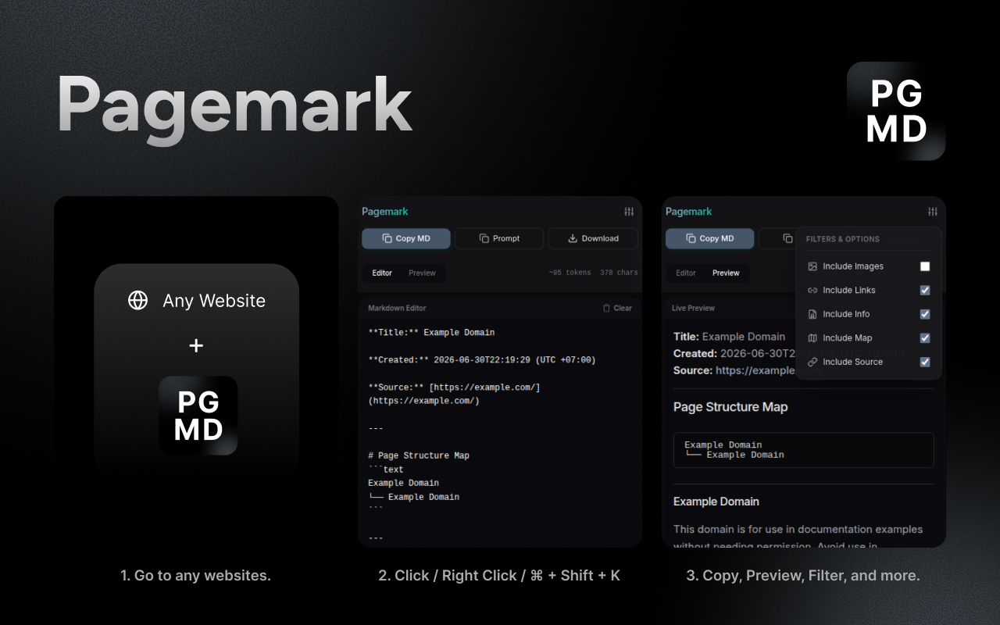
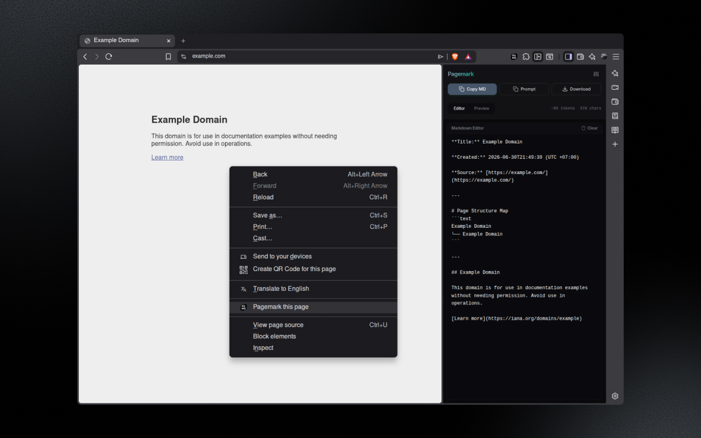

# Pagemark

> Convert any webpage into clean, LLM-ready Markdown in one click. Strip the clutter, preserve the layout, and copy or download instantly.



Pagemark is a modern web extension designed for researchers, developers, and AI engineers. It extracts the core content of any webpage and converts it into structured, optimized Markdown, perfect for feeding directly into LLMs (like GPT, Claude, Gemini) or storing in your personal knowledge base.

## How It Works

1. **Navigate** to any webpage you want to clip.
2. **Trigger**:
   - Right-click anywhere and select **"Pagemark this page"**, OR
   - Click the extension icon in your browser toolbar, OR
   - Press the hotkey **`Ctrl + Shift + K`** (or **`Cmd + Shift + K`** on macOS, configurable in `chrome://extensions/shortcuts`).
3. **Clip & Copy**: The side panel opens instantly, showing the live markdown, which is automatically copied to your clipboard (optional) or ready to download.

## Features

- **Smart Content Extraction**: Utilizes industry-standard readability extraction to isolate the main body content, ignoring distracting ads, popups, and nav bars.
- **Side Panel Workspace**: Runs inside a native browser Side Panel, letting you view, edit, and preview markdown side-by-side with your active webpage.
- **Live Markdown Preview**: Split tab view containing a raw **Markdown Editor** (with text area & char count) and a rendered **Live Preview** (with custom scrollable tables).
- **Persistent Preferences**: All toggles and preferences are stored in the browser's local storage and auto-save instantly:
  - **Include Images**: Toggle to keep/strip image tags (default: `false`).
  - **Include Links**: Toggle to preserve hyperlinks or keep just the anchor text (default: `true`).
  - **Include Info**: Adds page metadata (Title and timezone-aware Created timestamp).
  - **Include Source**: Appends the source page URL.
  - **Include Map**: Generates an hierarchical text tree outline of the document structure.
- **Export Options**:
  - **Copy MD**: Instantly copy raw markdown.
  - **Prompt**: Copies raw markdown with a code block wrapper.
  - **Download**: Saves as a `.md` file.

## Installation & Setup

Pagemark is built on the [Plasmo](https://docs.plasmo.com/) extension framework with React and Tailwind CSS.

### Prerequisites

- [Node.js](https://nodejs.org/) (v16+)
- A package manager: `npm` (default), `pnpm`, or `yarn`

### 1. Clone & Install

```bash
# Clone the repository
git clone https://github.com/rafifmsn/pagemark.git
cd pagemark

# Install dependencies
npm install
```

### 2. Run in Development Mode

```bash
npm run dev
```

This runs the Plasmo dev server and generates an active development build folder at `build/chrome-mv3-dev`.

### 3. Load the Extension in Your Browser

1. Open your browser (Brave, Chrome, Edge, Opera).
2. Navigate to **`chrome://extensions/`** (or select Extensions -> Manage Extensions).
3. Toggle the **"Developer mode"** switch in the top-right corner.
4. Click the **"Load unpacked"** button in the top-left.
5. Select the **`build/chrome-mv3-dev`** folder in this project directory.

The Pagemark sidebar icon will now appear in your toolbar!



## Building for Production

To compile a minified, production-ready build:

```bash
npm run build
```

The production output will be generated inside the **`build/chrome-mv3-prod`** folder, ready to be packaged or loaded unpacked for daily use.

## Tech Stack

- **Framework**: [Plasmo](https://plasmo.com/) (MV3)
- **UI & Layout**: [React](https://reactjs.org/) & [Tailwind CSS](https://tailwindcss.com/)
- **Parsing Engine**: `@mozilla/readability` & `Turndown` (with GFM tables plugin)

## License

Distributed under the MIT License. See [LICENSE](LICENSE) for more details.
