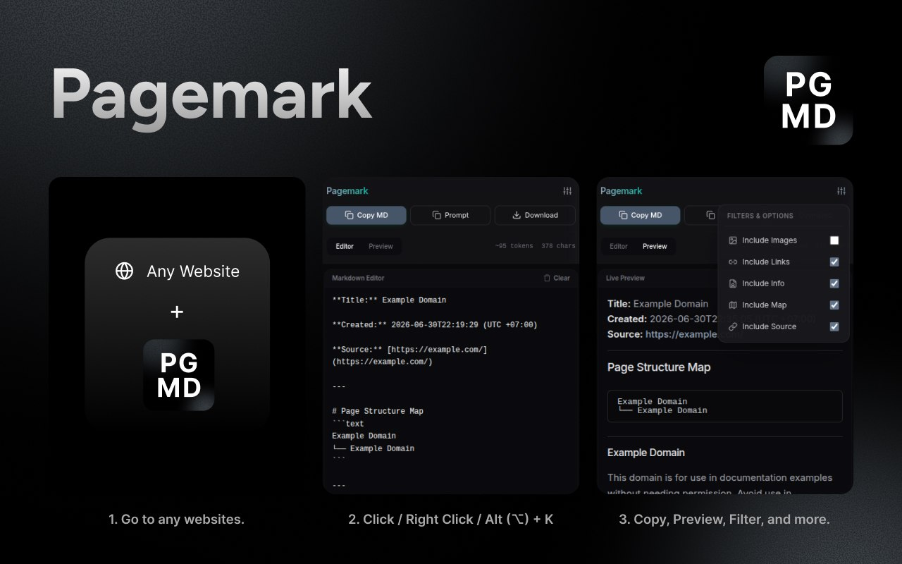
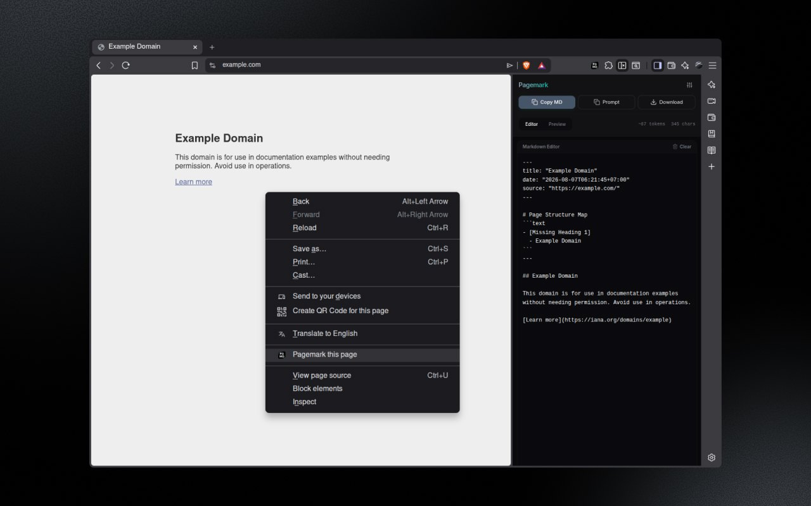

# Pagemark


[](https://chromewebstore.google.com/detail/dpnfgohhgehakmknbnpgojaalglhaeej)
[](https://addons.mozilla.org/firefox/addon/pagemark)



Pagemark is a modern web extension designed for researchers, developers, and AI engineers. It extracts the core content of any webpage and converts it into structured, optimized Markdown, perfect for feeding directly into LLMs (like GPT, Claude, Gemini) or storing in your personal knowledge base.

## How It Works

1. **Navigate** to any webpage you want to clip.
2. **Trigger**:
   - Right-click anywhere and select **"Pagemark this page"**, OR
   - Click the extension icon in your browser toolbar, OR
   - Press the hotkey **`Alt + K`** (or **`Option + K`** on macOS, configurable in `chrome://extensions/shortcuts` or `about:addons` on Firefox).
3. **Clip & Copy**: The side panel opens instantly, showing the live markdown, which is automatically copied to your clipboard (optional) or ready to download.

## Features

- **Co-existing Workspace**: Runs inside a native browser Side Panel (Chrome) or Sidebar (Firefox), letting you view, edit, and preview markdown side-by-side with your active webpage.
- **Smart Content Extraction**: Utilizes an isolated core readability parser to extract main body content while stripping out distracting ads, popups, and navigation bars.
- **Live Markdown Preview**: Split tab view containing a raw **Markdown Editor** (with text area & character count) and a rendered **Live Preview** (with custom scrollable GFM tables).
- **Absolute Heading Outline Map**: Injects a clean hierarchy outline map representing the document heading structure, with absolute indentation levels matching each heading type and explicit indicators for skipped heading levels.
- **Defensive Guards**: Built-in blockades protecting against execution errors on internal browser/system URLs.
- **Persistent Preferences**: All toggles and preferences are stored in local storage and auto-saved instantly:
  - **Include Images**: Toggle to keep or strip image tags.
  - **Include Links**: Toggle to preserve hyperlinks or keep just the anchor text.
  - **Include Info**: Adds page metadata (Title and standard ISO-8601 Created timestamp).
  - **Include Source**: Appends the source page URL.
  - **Include Map**: Generates the absolute heading outline map.
  - **Smart Auto-Copy**: Automatically copies converted markdown to the clipboard upon switching active tabs (backed by cross-context delegation for Firefox stability), complete with customizable site whitelisting (e.g., `*.google.com`, `localhost:3000`) to disable execution on specific hosts.

## Installation & Setup

Pagemark is built on the [Plasmo](https://docs.plasmo.com/) extension framework with React and Tailwind CSS, with `@mozilla/readability` and `turndown` imported from [pagemark-core](https://github.com/rafifmsn/pagemark-core).

### 1. Clone & Install

```bash
# Clone the repository
git clone https://github.com/rafifmsn/pagemark.git
cd pagemark

# Install dependencies
npm install
```

### 2. Run in Development Mode

```bash
# For Chrome / Chromium
npm run dev

# For Firefox
npm run dev:firefox
```

This runs the Plasmo dev server and generates an active development build folder at `pagemark-extension/build/chrome-mv3-dev` (or `pagemark-extension/build/firefox-mv3-dev`).

### 3. Building for Production

To compile a minified, production-ready build:

```bash
# Build for all targets (Chrome & Firefox)
npm run build:all

# Or build individually
npm run build:chrome
npm run build:firefox
```

The production output will be generated inside the **`pagemark-extension/build/chrome-mv3-prod`** and **`pagemark-extension/build/firefox-mv3-prod`** folders, ready to be packaged or loaded unpacked for daily use.



### 4. Load the Extension in Your Browser

#### Chrome / Chromium (Chrome, Brave, Edge, Opera)

1. Navigate to **`chrome://extensions/`** (or select Extensions -> Manage Extensions).
2. Toggle the **"Developer mode"** switch in the top-right corner.
3. Click the **"Load unpacked"** button in the top-left.
4. Select the **`pagemark-extension/build/chrome-mv3-dev`** folder in this project directory.

#### Firefox

1. Navigate to **`about:debugging`** in your URL bar.
2. Click **"This Firefox"** in the left sidebar.
3. Click the **"Load Temporary Add-on..."** button.
4. Select the **`manifest.json`** inside the **`pagemark-extension/build/firefox-mv3-dev`** folder.

## License

Distributed under the MIT License. See [LICENSE](LICENSE) for more details.
