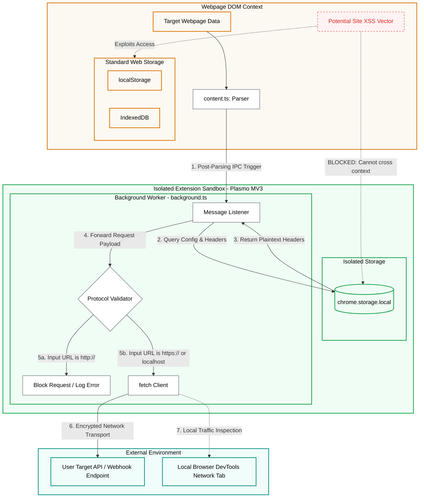

# System Architecture & Webhook Security

Pagemark is designed with a strict security boundary to protect user configurations, API endpoints, and authentication tokens (such as Bearer tokens) from site-level cross-site scripting (XSS) vulnerabilities.

## Secure Webhook Architecture

When you dispatch a parsed Markdown page to a custom webhook target, the data flow crosses an isolated boundary to ensure absolute safety:

---

## Key Security Blockades

### 1. Isolated Background Dispatch (CSP & CORS Bypass)
- **Problem**: Webpages have strict Content Security Policies (CSP) that restrict where scripts can send data. Content scripts (`content.ts`) running in the webpage DOM cannot send `fetch` requests to third-party endpoints or local servers.
- **Solution**: Pagemark sends an IPC message to the extension's background service worker (`background.ts`). The background worker performs the network request. Because the service worker runs in the extension sandbox, it bypasses the webpage's CSP rules and successfully routes requests to any target domain allowed under Pagemark's `<all_urls>` host permissions.

### 2. XSS Protection (Context Boundary)
- **Problem**: If target webpages suffer from Cross-Site Scripting (XSS) vulnerabilities, malicious scripts can read values stored in standard web storage like `localStorage` or `IndexedDB`.
- **Solution**: Pagemark stores webhook URLs and authorization headers in `chrome.storage.local`. This storage is completely invisible to the webpage context and target DOM. Webpage scripts cannot read or sniff your API keys.

### 3. Enforced HTTPS Transport
- **Problem**: Sending authentication tokens over unencrypted `http://` transport exposes them to Man-in-the-Middle (MitM) packet sniffing.
- **Solution**: The protocol validator enforces secure `https://` transport for all webhook dispatches. Standard `http://` transport is restricted to `localhost` and `127.0.0.1` contexts to assist local testing.
